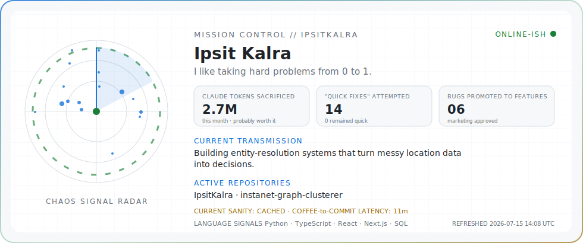

<picture>
  <source media="(prefers-color-scheme: dark)" srcset="./assets/mission-control-dark.svg">
  <source media="(prefers-color-scheme: light)" srcset="./assets/mission-control-light.svg">
  
</picture>

### Software + AI Engineer · entity resolution & data systems

I like tackling hard, ambiguous problems and taking them from 0 to 1.

---

## Selected work

<table>
<tr>
<td width="33%" valign="top">

### [Market Intelligence Engine](https://ipsitkalra.vercel.app/work/market-intelligence)

Reconciles one location's conflicting records across many marketplaces into a single decision-ready truth.

`Python` `SQL` `Entity resolution`

</td>
<td width="33%" valign="top">

### [Industrial Data Pipeline](https://ipsitkalra.vercel.app/work/industrial-data)

Turns raw, inconsistent operational records into a typed, validated feed, quarantining bad rows on the way through.

`Python` `SQL` `ETL`

</td>
<td width="33%" valign="top">

### [InstaNet Graph Clusterer](https://github.com/IpsitKalra/instagram-friend-group-detector)

Community detection and bridge-node analysis across roughly 900 Instagram accounts.

`Python` `NetworkX` `Louvain`

</td>
</tr>
</table>

More builds, with full case studies, live at [ipsitkalra.vercel.app](https://ipsitkalra.vercel.app).

The panel above refreshes every few hours via GitHub Actions.

