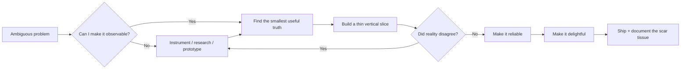

<!--
  MISSION CONTROL PROFILE README
  Replace every YOUR_* placeholder, then delete this comment.
-->

<picture>
  <source media="(prefers-color-scheme: dark)" srcset="./assets/mission-control-dark.svg">
  <source media="(prefers-color-scheme: light)" srcset="./assets/mission-control-light.svg">
  
</picture>

<div align="center">

### `systems thinker` · `builder` · `YOUR_SPECIALTY`

[](YOUR_PORTFOLIO_URL)
[](YOUR_LINKEDIN_URL)
[](mailto:YOUR_EMAIL)

</div>

---

## `// CURRENT TRANSMISSION`

> **I am currently building:** YOUR_CURRENT_BUILD  
> **I am currently learning:** YOUR_CURRENT_LEARNING  
> **I would love to collaborate on:** YOUR_COLLAB_INTEREST

The panel above is regenerated by GitHub Actions from [`NOW.md`](./NOW.md), [`TELEMETRY.json`](./TELEMETRY.json), and a small amount of public repository data. The weird metrics are deliberately personal—not a follower counter in disguise. The Claude token metric can optionally use live Anthropic organization API usage.

## `// SELECTED MISSIONS`

<table>
<tr>
<td width="33%" valign="top">

### 01 · [PROJECT_ONE](YOUR_PROJECT_ONE_URL)

**The impossible-sounding sentence:**  
One sharp sentence explaining what it does and why it matters.

`YOUR_TECH` `YOUR_TECH` `YOUR_TECH`

**Proof:** YOUR_RESULT_OR_METRIC

</td>
<td width="33%" valign="top">

### 02 · [PROJECT_TWO](YOUR_PROJECT_TWO_URL)

**The strange constraint:**  
Describe the limitation that made the project technically interesting.

`YOUR_TECH` `YOUR_TECH` `YOUR_TECH`

**Proof:** YOUR_RESULT_OR_METRIC

</td>
<td width="33%" valign="top">

### 03 · [PROJECT_THREE](YOUR_PROJECT_THREE_URL)

**The lesson that survived:**  
Share one non-obvious engineering insight, not a feature list.

`YOUR_TECH` `YOUR_TECH` `YOUR_TECH`

**Proof:** YOUR_RESULT_OR_METRIC

</td>
</tr>
</table>

## `// HOW MY BRAIN ROUTES A PROBLEM`



## `// HUMAN API`

```yaml
name: YOUR_NAME
location: YOUR_LOCATION
focus:
  - YOUR_FOCUS_AREA
  - YOUR_FOCUS_AREA
inputs:
  - difficult problems
  - honest feedback
  - unreasonable curiosity
outputs:
  - working software
  - clear explanations
  - systems that age well
operating_principles:
  - "Make it work, then make the model simpler."
  - "Measure the boring failure modes."
  - "Leave the codebase easier to understand."
```

<details>
<summary><b><code>// OPEN PRIVATE DEBUG SYMBOLS</code></b></summary>
<br>

| Signal | Value |
|---|---|
| Best environment | YOUR_BEST_ENVIRONMENT |
| Current rabbit hole | YOUR_RABBIT_HOLE |
| Unexpected skill | YOUR_UNEXPECTED_SKILL |
| Ask me about | YOUR_ASK_ME_ABOUT |
| Outside the terminal | YOUR_HOBBY |

### Tiny beliefs

- A portfolio should show judgment, not just output.
- The best abstractions are discovered after contact with reality.
- Documentation is part of the interface.

</details>

## `// OPEN A CHANNEL`

Choose a protocol instead of sending “hey”:

- [`/collaborate`](https://github.com/YOUR_USERNAME/YOUR_USERNAME/issues/new?title=%5BCOLLAB%5D%20Your%20idea&body=What%20are%20we%20building%3F%0A%0AWhy%20does%20it%20matter%3F%0A%0AWhat%20would%20a%20great%20outcome%20look%20like%3F) — propose something worth building.
- [`/challenge`](https://github.com/YOUR_USERNAME/YOUR_USERNAME/issues/new?title=%5BCHALLENGE%5D%20A%20problem%20for%20you&body=Here%20is%20the%20problem%3A%0A%0AConstraints%3A%0A%0AWhat%20I%20have%20already%20tried%3A) — send me an interesting technical problem.
- [`/ask`](https://github.com/YOUR_USERNAME/YOUR_USERNAME/issues/new?title=%5BASK%5D%20Question&body=My%20question%3A%0A%0AContext%3A) — ask a precise question.

<div align="center">

<sub>Last dashboard refresh is shown inside the mission-control panel. Vanity metrics were rejected by mission control.</sub>

</div>
